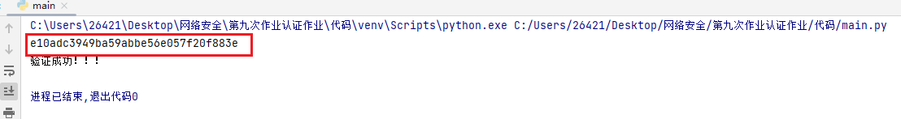
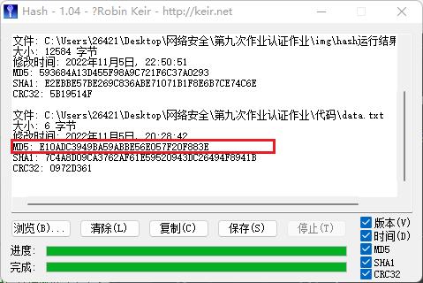

## 第九次作业--认证作业
### 1. 选择语言提供的Hash函数，计算数据的Hash值 
```python
# hash值读取
def hash_read():
    diretory = '.\data.txt'
    if  os.path.isfile(diretory):
        md5_1 = hashlib.md5()  # 创建一个md5算法对象
        with open(diretory, 'rb') as f:  # 打开一个文件，必须是'rb'模式打开
            while 1:
                data = f.read(1024)  # 由于是一个文件，每次只读取固定字节
                if data:
                    md5_1.update(data)   # 当读取内容不为空时对读取内容进行update
                else:
                    break
        ret = md5_1.hexdigest()        # 获取这个文件的MD5值
        print(ret)
    else:
        print('对应文件路径不存在！')
```
- 代码运行结果

- 软件运行结果，两者一致，代码无问题

### 2. 用私钥对 Hash值 进行签名。
- 结果保存在sig_results.txt文件中，可查看
```python
# 私钥签名
def signature(privatekey,data):
    # 获取data的HASH值
    digest = MD5.new(data.encode('utf-8'))
    # 使用私钥对HASH值进行签名
    signature = pkcs1_15.new(privatekey).sign(digest)
    # 将签名结果写入文件
    sig_results = open("sig_results.txt", "wb")
    sig_results.write(signature)
    sig_results.close()
```

### 3. 用公钥对签名值进行验证。
- 调用库里的函数，通过调入私钥、数据的hash进行验证
```python
def verifier(public_key, data, signature):
    digest = MD5.new(data.encode('utf-8'))
    try:
        pkcs1_15.new(public_key).verify(digest, signature)
        print("验证成功！！！")
    except:
        print("签名无效！！！")
```