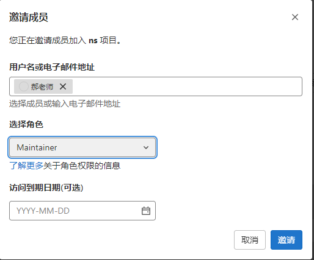

# 网络安全第三次作业
# 1、安全相关事件
## 1.1、学习通数据库疑泄露，1.7亿数据被非法售卖

超星学习通是国内众多高校使用的电子化课程学习软件。2022年6月，有公众号博主发现社工库正在出售超星学习通数据库，这份数据库包含1亿7273万条数据，同时还包含1076万条密码，数据涉及学校名称、学生姓名、注册手机号码、学号、工号、性别以及邮箱等。如此规模的数据库目前售价仅1500美元，说明这份数据库已经黑市里流传了很久。

## 1.2、台湾地区领导人办公室网站受网络攻击

环球网报道，路透社援引据知情人士消息称，台湾地区领导人办公室网站2日受到海外网络攻击，一度出现故障。该消息人士称，网站很快便恢复运作。台“总统府”晚间证实，傍晚官网一度遭受海外网络攻击，经处置于20分钟后恢复正常运作。

## 1.3、网络攻击致使英国医疗救助热线“120”发生重大中断

安全内参8月9日消息，由于受到网络攻击影响，英国国家医疗服务体系（NHS）的111救助热线（注：包括常规求助和急救，部分类似我国的120热线）发生重大持续性中断。

这次网络攻击袭击了NHS的本地托管服务提供商Advanced。根据状态页面信息显示，111急救热线约85%的服务都在使用Advanced公司提供的Adastra客户患者管理解决方案。本次攻击令Adastra解决方案以及Advanced提供的其他几项服务同时陷入重大中断。

威尔士救护车服务中心表示，“当地用于将111救助热线患者转诊给急诊全科医师的计算机系统，近期出现了重大故障。”“持续中断已经造成严重冲击与深远影响，覆盖了英国的英格兰、威尔士、苏格兰及北爱尔兰四大地区。”

## 1.4、亲俄黑客组织Killnet声称对美国防巨头洛马发起网络攻击

E安全8月15日消息 ，据莫斯科时报报道称，亲俄黑客组织Killnet声称对最近袭击航空航天和国防巨头洛克希德马丁公司的 DDoS 攻击负责。Killnet 组织还声称从洛克希德马丁公司的一名员工那里窃取了数据，并威胁要分享这些数据。

该组织自3月以来一直活跃，它对意大利、罗马尼亚、摩尔多瓦、捷克共和国、立陶宛、挪威和拉脱维亚等表示支持乌克兰的政府发起 DDoS 攻击。这家公司是“海马斯”（HIMARS）火箭炮的生产商。

该组织在 Telegram 上分享的一段视频中，该组织声称窃取了洛克希德马丁公司员工的个人信息，包括姓名、电子邮件地址、电话号码和图片。
# 2、项目初始化
## 2.1、新建项目

## 2.2、仓库命名
 
 ## 2.3、邀请老师
 
# 3、多级标题的练习
# 一级标题
## 二级标题
### 三级标题
#### 四级标题
##### 五级标题
###### 六级标题
# 列表的练习
## 无序列表使用* + - 来表示
* 1
* 2
* 3
+ 1
+ 2
+ 3
- 1
- 2
- 3
## 有序列表
1. A
2. B
3. C
## 列表嵌套 在子列表前加入一个Tab即可
1. A
	- 1
	- 2
	- 3
2. B
	- 1
	- 2
	- 3
3. C
	- 1
	- 2
	- 3
# 练习链接和图片的插入
## 链接的语法格式：
此处链接以作业一里网络安全事件的URL为例子：[网络安全事件](https://baijiahao.baidu.com/s?id=1684390363819611797&wfr=spider&for=pc)
## 图片的插入

