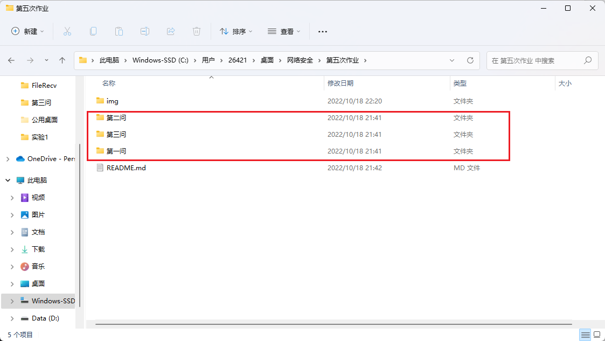
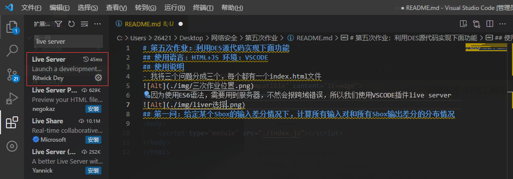
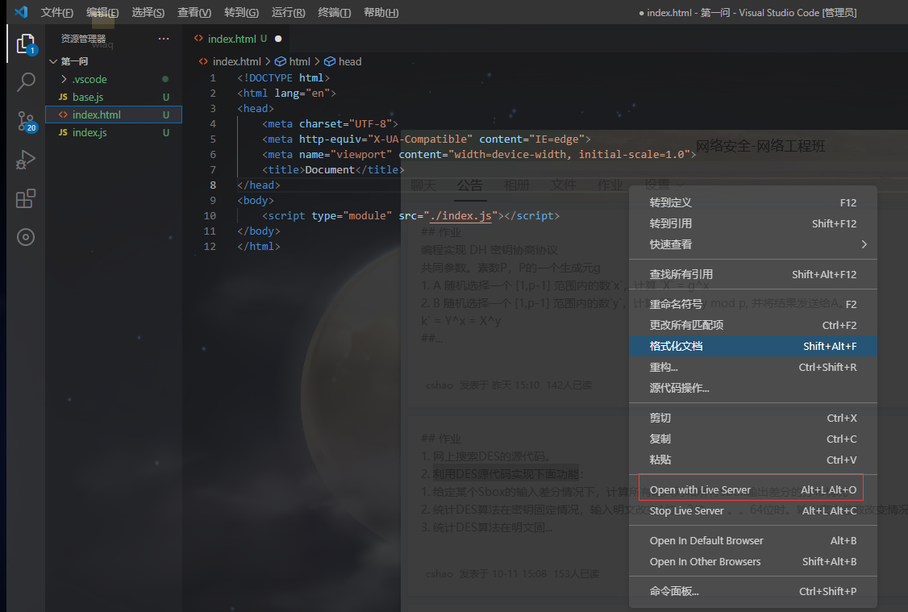
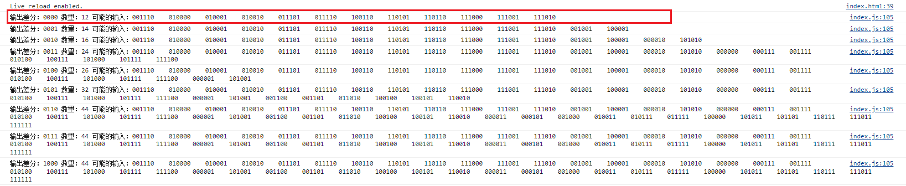
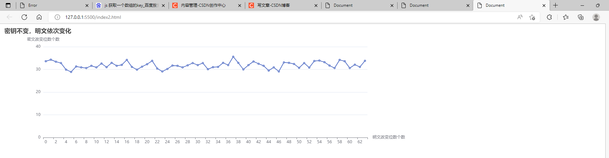
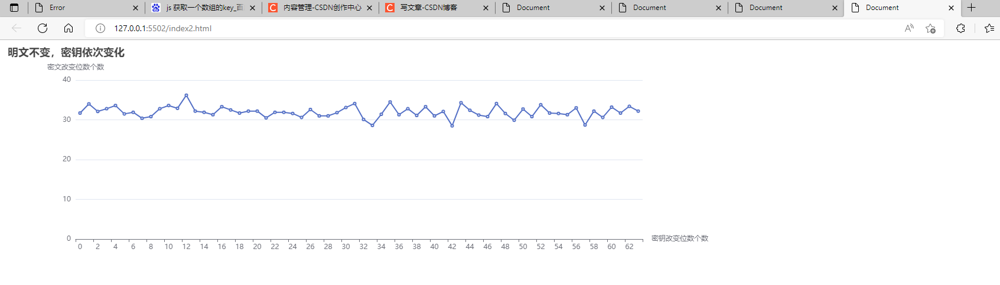

# 第五次作业：利用DES源代码实现下面功能
## 使用语言：HTML+JS 环境：VSCODE
## 使用说明
### 我将三个问题分成三个，每个都有一个index.html文件

### 因为使用ES6语法，需要用到服务器，不然会报跨域错误，所以我们使用VSCODE插件live server
- 插件安装

- 服务器开启

## 第一问：给定某个Sbox的输入差分情况下，计算所有输入对和所有Sbox输出差分的分布情况
### 在index.js中的主函数表明了思路：
- 输入差分和输入值异或，再进行S盒运算得到结果1
- 输入值直接进行S盒运算，得到结果2
- 结果1和结果2进行异或，得到输出差分
- 遍历所有输出差分查找符合条件的输入值
```javascript
function volume_up(){
    //声明一个差分
    let input_diff_value = "101000"
    //用于存放符合条件的内容
    let arr = []
    //初始输出差分
    let output_diff_value = 0
    //遍历每一个输出差分
    for (let i = 0 ; i < 16 ; i++ ){
        //输出差分转为二进制四位
        output_diff_value =  DEC.getBoxBinary(i)
        //遍历所有输出值--六位二进制
        for (let j = 0;j < 64;j++){
            //输入值（二进制六位）
            let input_value = getBoxBinary_64(j)
            //输入值和初始差分进行异或，再进行S盒运算得到结果：result_one
            let result_one = DEC.sBoxPermute(DEC.xor(input_diff_value,input_value))
            //arr用于存放由字符串类型的输入值input_value转化为数组类型（是由于S盒运算的是数组，需要这一步）
            let arr1 = []
            for (let item of input_value){
                arr1.push(parseInt(item))
            }
            //将正常的输入值进行S盒运算，然后与上方的result_one进行异或运算得到resulit_two
           //resulit_two为int数组再转字符串--为了后续与输出差分output_diff_value（字符串类型）比较
            let resulit_two = DEC.xor(DEC.sBoxPermute(arr1),result_one).join("")
            //resulit_two与输出差分output_diff_value一致，则输入值为有可能的值
            if (resulit_two === output_diff_value){
                arr.push(input_value)
            }
        }
        //浏览器输出
        console.log(`输出差分：${output_diff_value} 数量：${arr.length} 可能的输入：${arr.join("    ")}` )
    }
}
```
### 在index.html用live server打开后，我们F12打开开发人员工具，可以看到格式为输出差分；可能的输入数量；可能的输入值（以空格隔开）

## 二、三问：统计DES算法在密钥（明文）固定情况，输入明文（密钥）改变1位、2位，。。。64位时。输出密文位数改变情况。
### 打开方式与第一问一样
### 在index2.js中的主函数表明了思路：
- 生成密钥（明文）
- 计算初始密文
- 改变次数为64，每次改变位数从1到64逐渐增加
- 改变位数的功能函数为random_change_bt(copy_bt,i)，该函数将随机抽取i个数字作为修改的索引号
- 再次生成新密文
- 将新旧密文进行比较，将数据存入change_number_arr数组
- 持续进行times次（可在源代码上修改此变量）
- 计算平均值
```javascript

function start(){
    for (let j = 0;j<times;j++){

            //生成密钥--调用random_key()
            let keyB = random_key()
            //计算出初始密文--用于比较
            const init_secert_value = DES.test(bt,keyB)

            //64次，改变各位数
            for (let i = 0;i < 64;i++){
                //获得一个深拷贝明文的数组
                let copy_bt = deep_arr(bt)
                //改变一位，是1变0；是0变1
                // console.log(copy_bt)
                // copy_bt[i] = (copy_bt[i] === 0?1:0)
                //调用该函数，随机改变i位
                random_change_bt(copy_bt,i)
                // console.log(copy_bt)
                //再次调用DES，获得新的密文
                let new_secret_value = DES.test(copy_bt,keyB)
                //将数据填入统计数组 第一次直接push就行；后面在第一次的基础上增加
                if (j===0)  change_number_arr.push(compare_arr(init_secert_value,new_secret_value))
                else change_number_arr[i] += compare_arr(init_secert_value,new_secret_value)
            }
            // console.log(change_number_arr)
    }
        
    //最后一步，统计出平均数据
    for (let key in change_number_arr){
        change_number_arr[key] = parseFloat(change_number_arr[key])/times
    }
    // console.log(change_number_arr)
}
```
### 在index2.html用live server打开后，我们可以看到对应情况
- 第二问

- 第三问
- 