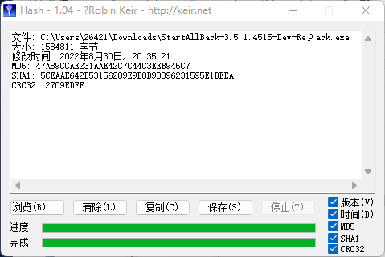

## 第八次作业--Hash作业 
## 利用软件提供的Hash函数实现查找本地硬盘重复文件。编程并撰写报告。 

### 1. 首先计算硬盘文件的Hash，并记录文件路径与Hash值的对应关系 
我们使用Hash - 1.04进行文件hash值的计算：可以看到对应文件的MD5、SHA1、CRC32值

## 2. 利用具有相同Hash值的文件，内容就极其可能相同的特性，查找具有相同Hash值的文件。 
通过查询网上相关博主代码，可以简单实现查找同一文件下是否存在相同hash的文件，并删除多余的。
- 我们先在d盘的hash文件夹下建立两个内容一样的文件

- 然后我们运行代码，结果如图所示：可以看到存放hash值的数组即为这两个文件的hash值，是一样的，所以后续程序也将后面重复hash值的文件删除

3. 可以简单比较一下具有相同Hash值的文件是否长度，部分随机内容相同，如果相同则直接输出，否则说明发生了碰撞。
- 可以看到两个hash值相同的文件长度是相同的
 