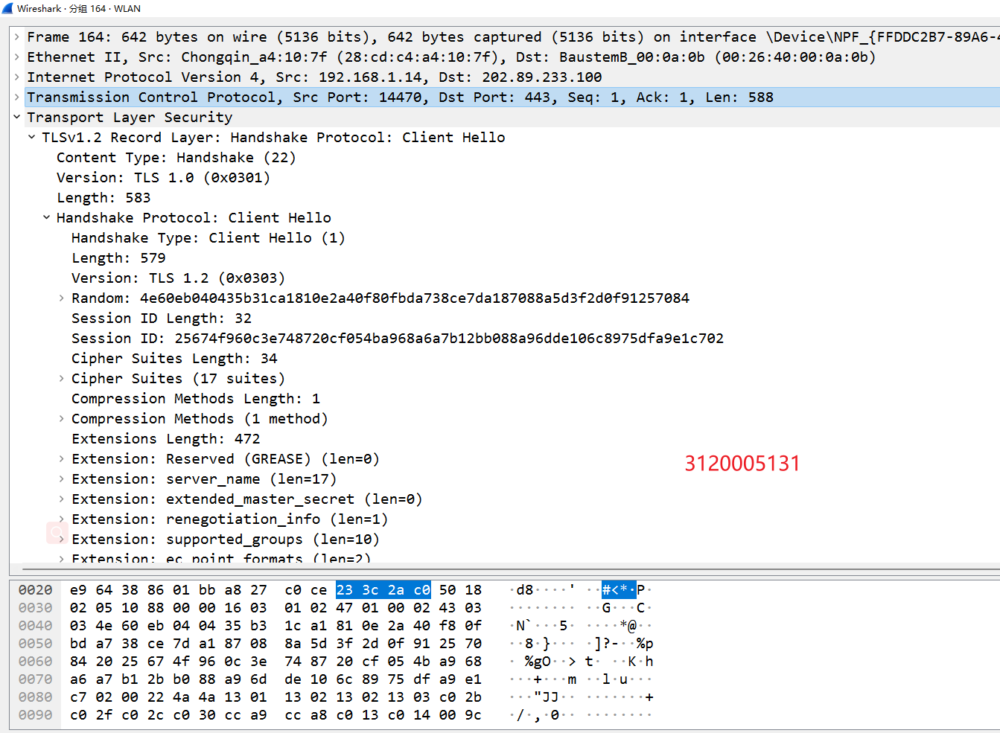
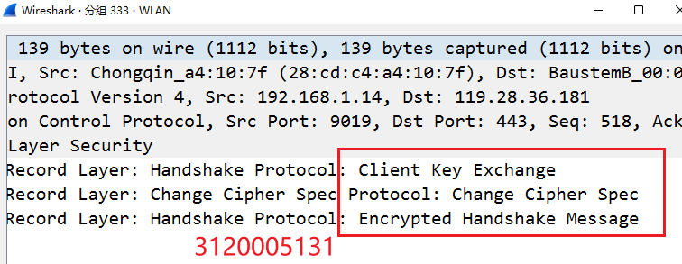
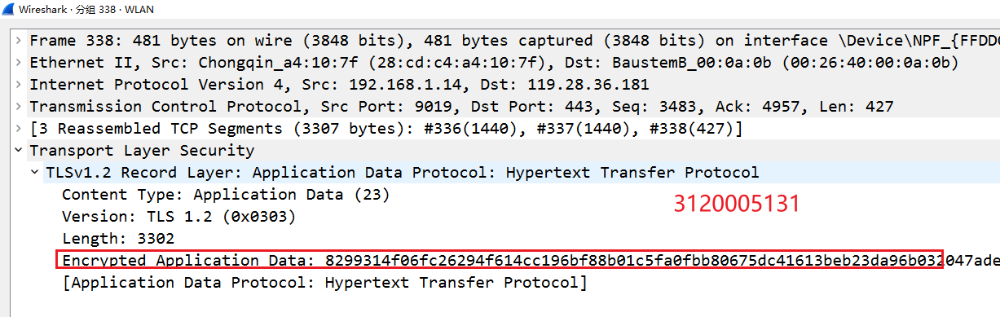

# SSL实验
## 1、实验内容
配置并抓包分析 SSL协议
## 2、实验过程
### 2.1、 软件的安装
这里我们选择比较熟悉的抓包软件Wireshark
理由如下：
- 1、Wireshark是一个网络封包分析软件。网络封包分析软件的功能是截取网络封包，并尽可能显示出最为详细的网络封包资料。
- 2、Wireshark是一款免费且功能强大的软件，版本不断迭代更新，功能完善强大
- 3、Wireshark不仅仅在截取数据包上有着强大的功能，而且在不同协议下分析包也有着强大的追踪流，非常符合实验的功能要求
### 2.2、前提准备
#### 2.2.1、安装Wireshark
我们在官网安装最新版本的wireshark，不建议安装较旧版本的，因为旧版本功能比较不齐全，可能会没有本实验所需要的TLS追踪流

### 2.3、抓包流程
#### 2.3.1、 在抓包前先配置好抓包所要监视的IP地址，这里我们选择WLAN的网卡

#### 2.3.2、 点击开始后抓包开始，可以看到wireshark正处于抓包状态

#### 2.3.3、执行需要抓包的操作，在cmd下输入ping www.github.com（这里以github为例子）

#### 2.3.4、执行后可以在抓包界面看到对应的抓包数据，右键选择TSL跟踪流即可进行TLS分析

### 2.4、SSL握手过程
#### 2.4.1、第一个SSL握手是客户端向服务器发起的Client Hello消息--初始化阶段
- 1、可以看到第四层是TCP协议，源端口是随机的端口，目的端口是443
- 2、并且在TLS协议的第一行中写道：是一个Handshake握手协议，内容是Client Hello

- 3、也可以看到TLS协议所支持的密文族

#### 2.4.2、 服务器回复--认证阶段
 - 1、首先是回复客户端：Server Hello
 - 2、之后是发送证书给客户端

#### 2.4.3、客户端验证--密钥协商阶段
- 1、客户端收到服务器发来的证书，并加以验证，验证完毕后生成一个本地的随机密码，并且把密码发给服务器，并且开始加密后续的握手信息

#### 2.4.4、握手结束
- 握手结束后，后面就以协商好的密钥开始加密并发送HTTP数据包了

## 3、实验小结
- 1、进一步熟悉对wireshark的使用和运用，更加了解了其丰富的功能
- 2、通过实验加深对SSL/TLS协议的印象，知道在其中运用了非对称和对称加密算法，了解HTTPS背后的协议内涵
- 3、更加明白数据交互过程中对于安全性的操作和重要性