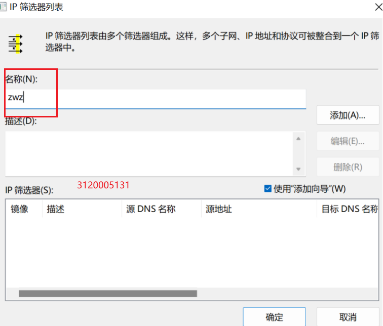
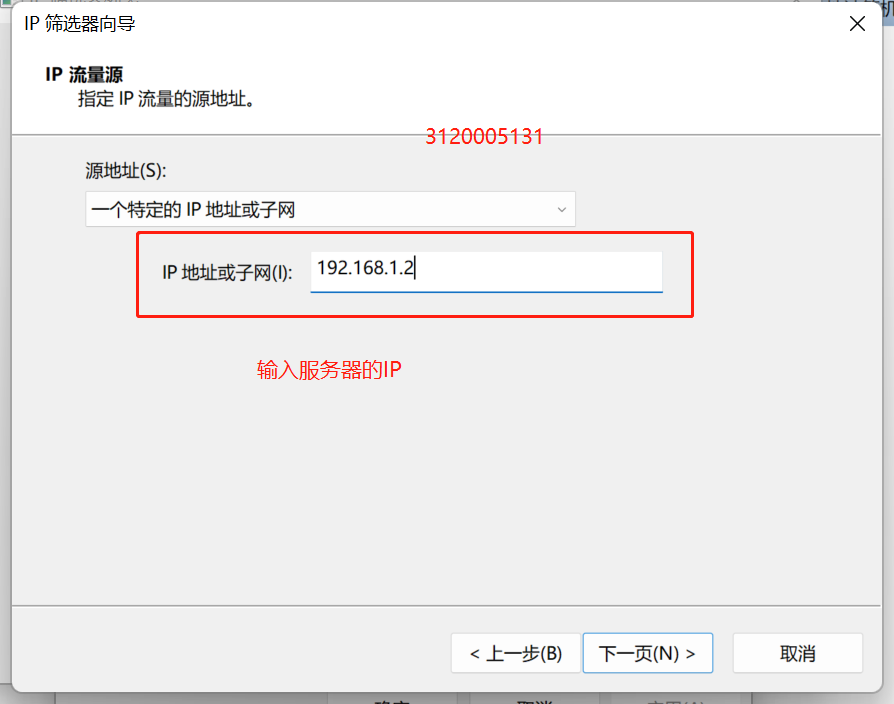
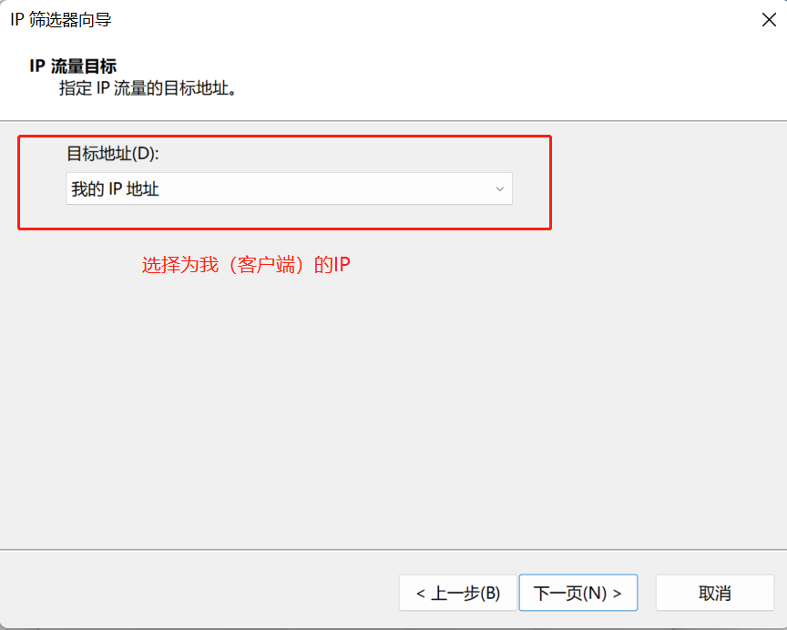
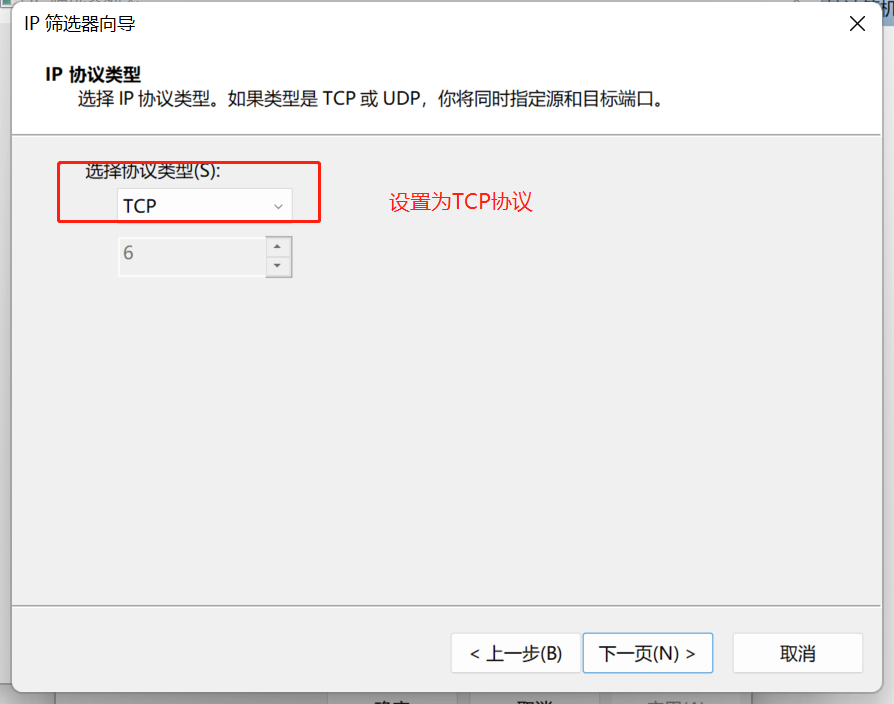
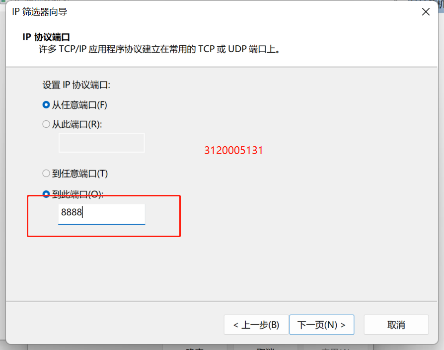
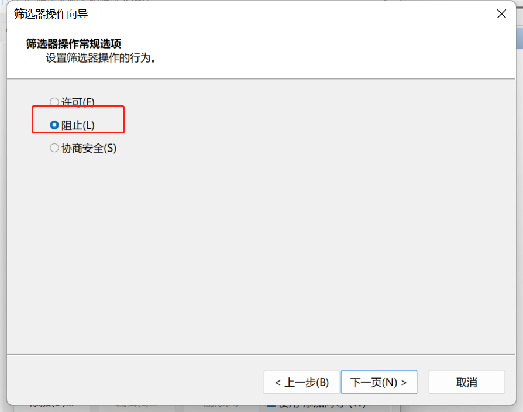
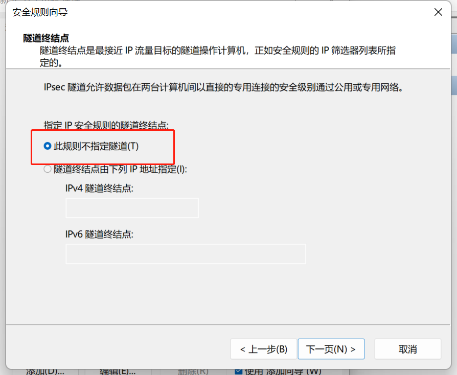
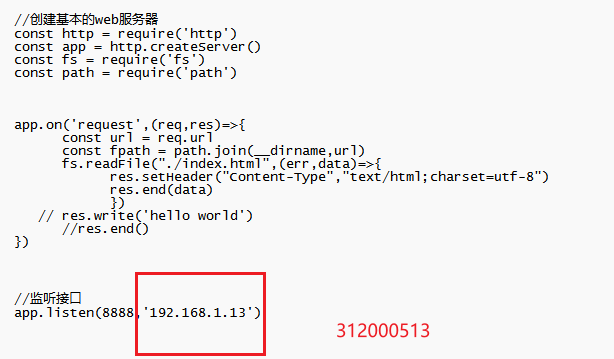
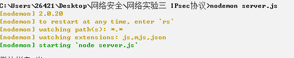

# IPsec实验
## 1、实验内容
配置并抓包分析 IPsec协议
## 2、实验过程
### 2.1、 软件的安装
用到的软件为wireshark和RawCap抓包软件
### 2.2、IPSec的设置
#### 2.2.1、实验目标 使客户端不能够用TCP协议访问服务器的8888端口
#### 2.2.2、创建IPSec规则
- 通过本地mmc指令进入本地安全设置

- 进入管理IP筛选器后添加，输入名字
- 

- 源地址输入服务器IP地址（已改为192.168.1.13）

- 目的地址设为本身的IP地址

- IP协议类型设置为TCP类型

- 设置从任意端口到8888端口

- 切换到管理筛选器操作，因为创建了IP筛选器，但还需要设置是禁止还是允许

- 右键创建IP安全策略

- 右键属性进入刚刚创建的IP安全策略，添加
- 选择不指定隧道

- 选择新建的筛选表zwz
- 
- 选择筛选器操作

#### 2.2.3、服务器配置
- 这里我们使用nodejs开启一个本地的服务器，代码如下

- 并且使用nodemon启动

### 2.3 筛选器启动前抓包服务器
#### 2.3.1、网页访问

#### RawCap抓包获取

#### 将生成的文件在wireshark打开，可以看到是成功的

### 2.4、打开IPSec筛选器
#### 2.4、开始分配

#### 2.4.3、重复2.3步骤，再次打开抓包文件，发现已找不到刚刚的http包

## 3、实验总结
- 1、首先了解到IPsec是一组开放的网络安全协议。它并不是一个单独的协议，而是一系列为IP网络提供安全性的协议和服务的集合。
- 2、明白其中的工作原理：
>
>当两台计算机相互连接的时候，它们之间的数据包会通过TCP/IP协议传送出去。但是TCP/IP协议并不是绝对安全的：一方面因为TCP/IP协议本身并不安全；另一方面因为一些攻击者可以通过伪造的数据包进行欺骗式攻击。
针对上述情况IPSEC技术应运而生：利用一种特殊的加密方法将数据包的源地址与目的地址分开来进行加密并封装成一个个独立的分组。
然后由这些分组构成一个虚拟的网络接口，再由这个虚拟的网络接口去连接其他设备或服务器等资源以实现数据传输的目的。

- 3、学会在电脑上配置筛选器，从而实现IPSec协议功能，并能够通过抓包软件进行验证