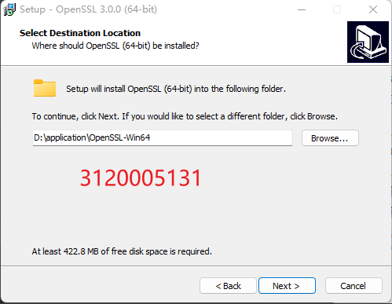
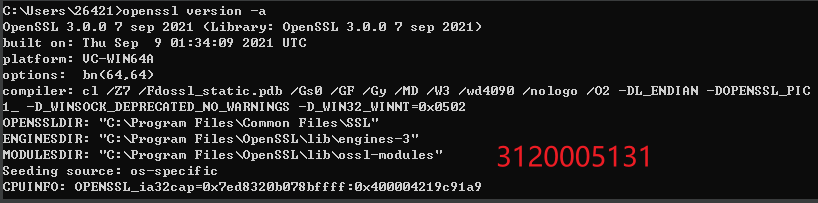
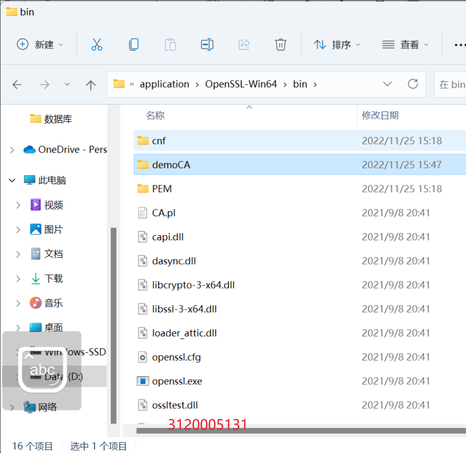
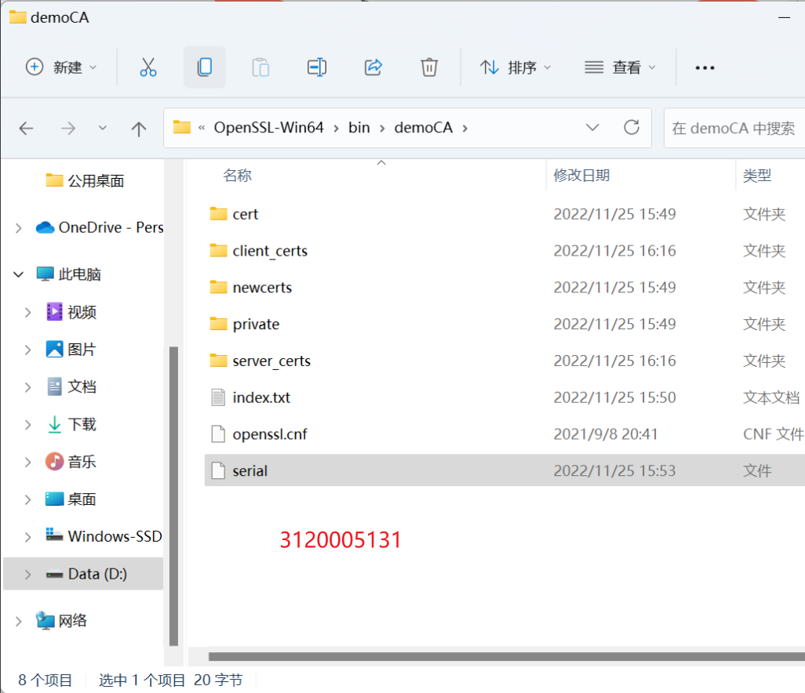
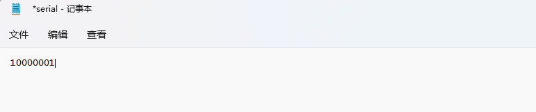
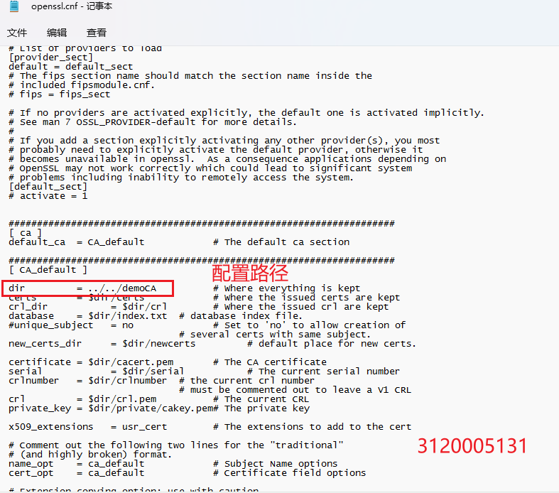
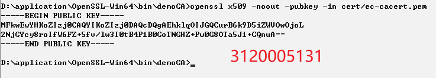
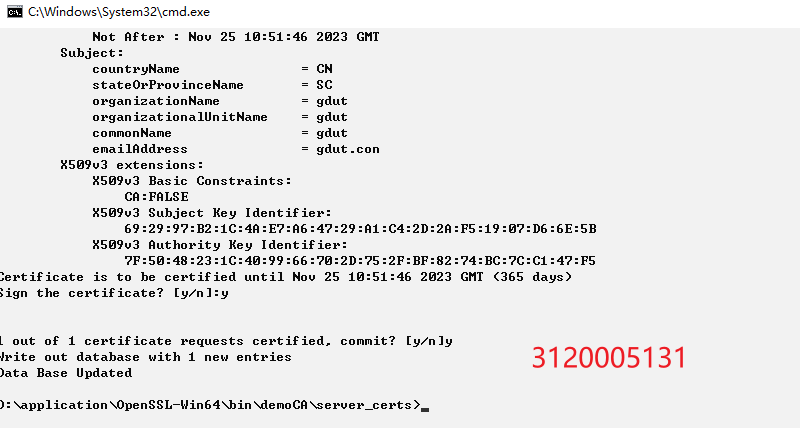
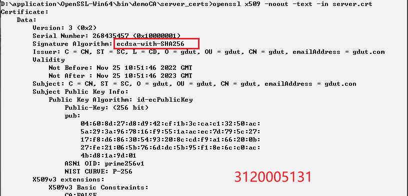
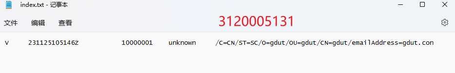

# PKI实验
##  1、实验内容
 安装PKI平台软件，练习证书的申请，创建，分发等操作
## 2、实验过程
### 2.1、 软件的安装
这里我们选择openssl平台软件
理由如下：
- 1、密钥和证书管理是PKI的一个重要组成部分，OpenSSL为之提供了丰富的功能，支持多种标准。
- 2、OpenSSL提供的CA应用程序就是一个小型的证书管理中心（CA），实现了证书签发的整个流程和证书管理的大部分机制。
- 3、OpenSSL支持Linux、Windows、BSD、Mac、VMS等平台，这使得OpenSSL具有广泛的适用性
### 2.2、前提准备
#### 2.2.1、安装openssl
我们通过渠道下载windows版64位的安装包

#### 2.2.2、环境配置
下载完毕后设置系统环境变量，将刚刚所安装的路径下的bin的路径，加入到path

然后cmd打开 可通过以下命令查看是否安装成功
> openssl version -a

#### 2.2.3、功能文件的配置
之后到任意地方新建一个文件夹，这里以demoCA为例子

在该目录下，我们需要新建以下文件 
>文件功能
>private: 用于存放CA私钥
>cert：用于存放CA自签的CA证书
>client_certs: 用于存放经CA签发好的客户端证书集合
>server_certs: 用于存放经CA签发好的服务器证书集合
>newcerts: 用于存放经CA签发好的所有证书集合并编号
>index：用于存放证书索引信息
>serial： 用于存放证书编号，并在serial文件中添加10000001初始编号，之后每签名一个新证书，编号自动+1
>openssl.cnf为配置文件，可以从目录bin/cnf中拷贝过来

最后，我们需要将bin下cnf文件内的openssl.cnf文件拷贝一份到上述内，并在serial文件填入初始编号10000001

### 2.3、建立CA，创建自签名证书
在自己创建的文件夹下以命令行形式进入（这里为demoCA）
#### 2.3.1、生成CA ECC密钥
输入以下命令
>openssl ecparam -out private/ec-cakey.pem -name prime256v1 -genkey

⽣成秘钥时，openssl默认仅存储曲线的名字
输入以下命令
>openssl ecparam -in private/ec-cakey.pem -text -noout

#### 2.3.1、生成CA证书
使用上一步生成的CA私钥，生成CA证书
>openssl req -new -x509 -days 3650 -config openssl.cnf -extensions v3_ca -key private/ec-cakey.pem -out cert/ec-cacert.pem

接下来，我们可以验证下CA证书的内容和使用的签名算法
>openssl x509 -noout -text -in cert/ec-cacert.pem

可以看到，我们使用的是ECDSA签名算法来生成我们的CA证书，而不是使用的RSA。

使用私钥验证CA证书
>openssl x509 -noout -pubkey -in cert/ec-cacert.pem

类似的我们可以从私钥导出公钥
>openssl pkey -pubout -in private/ec-cakey.pem

可以看到生成的公钥是相同的

### 2.4、使用CA私钥和证书签发服务端证书
#### 2.4.1、生成服务器端私钥
命令行进入server_certs文件夹
> cd server_certs

我们再一次使用曲线prime256v1生成ECC的私钥
>openssl ecparam -out server.key -name prime256v1 -genkey

验证曲线：
>openssl ecparam -in server.key -text -noout

#### 2.4.2、 生成服务端证书请求文件CSR
生成CSR请求：
>openssl req -new -key server.key -out server.csr -sha256

现在我们使用ECC CA私钥，CA证书，对server.csr进行签名，生成服务端证书：
>openssl ca -keyfile ../private/ec-cakey.pem -cert ../cert/ec-cacert.pem -in server.csr -out server.crt -config ../openssl.cnf

这里我们需要注意路径问题 
- 报错情况

- 我们可以根据报错情况，和当前所处目录位置，修改之前的openssl.cnf中的dir。修改后再次执行：

#### 2.4.3、验证证书是否有效时使用CA证书进行验证
>openssl verify -CAfile ../cert/ec-cacert.pem server.crt

我们也可以验证服务器证书的签名算法，确保使用的是ECC私钥
>openssl x509 -noout -text -in server.crt

#### 2.4.4、验证index.txt

## 2、实验小结
 - 学习到了如何安装openssl，并配置相关环境变量，与之前配置python、 npm 类似，较为上手
 - 了解到CA的工作功能：负责签发、认证和管理证书。并且学会使用openssl命令生成CA证书
 - 能够生成服务器端证书，并且发送请求，且记录在index文件中