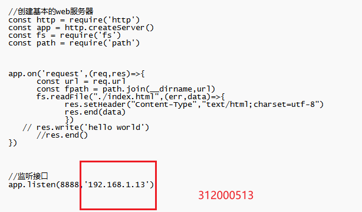

# PKI实验
##  1、实验内容
 安装PKI平台软件，练习证书的申请，创建，分发等操作
## 2、实验过程
### 2.1、 软件的安装
这里我们选择openssl平台软件
理由如下：
- 1、密钥和证书管理是PKI的一个重要组成部分，OpenSSL为之提供了丰富的功能，支持多种标准。
- 2、OpenSSL提供的CA应用程序就是一个小型的证书管理中心（CA），实现了证书签发的整个流程和证书管理的大部分机制。
- 3、OpenSSL支持Linux、Windows、BSD、Mac、VMS等平台，这使得OpenSSL具有广泛的适用性
### 2.2、前提准备
#### 2.2.1、安装openssl
我们通过渠道下载windows版64位的安装包

#### 2.2.2、环境配置
下载完毕后设置系统环境变量，将刚刚所安装的路径下的bin的路径，加入到path

然后cmd打开 可通过以下命令查看是否安装成功
> openssl version -a

#### 2.2.3、功能文件的配置
之后到任意地方新建一个文件夹，这里以demoCA为例子

在该目录下，我们需要新建以下文件 
>文件功能
>private: 用于存放CA私钥
>cert：用于存放CA自签的CA证书
>client_certs: 用于存放经CA签发好的客户端证书集合
>server_certs: 用于存放经CA签发好的服务器证书集合
>newcerts: 用于存放经CA签发好的所有证书集合并编号
>index：用于存放证书索引信息
>serial： 用于存放证书编号，并在serial文件中添加10000001初始编号，之后每签名一个新证书，编号自动+1
>openssl.cnf为配置文件，可以从目录bin/cnf中拷贝过来

最后，我们需要将bin下cnf文件内的openssl.cnf文件拷贝一份到上述内，并在serial文件填入初始编号10000001

### 2.3、建立CA，创建自签名证书
在自己创建的文件夹下以命令行形式进入（这里为demoCA）
#### 2.3.1、生成CA ECC密钥
输入以下命令
>openssl ecparam -out private/ec-cakey.pem -name prime256v1 -genkey

⽣成秘钥时，openssl默认仅存储曲线的名字
输入以下命令
>openssl ecparam -in private/ec-cakey.pem -text -noout

#### 2.3.1、生成CA证书
使用上一步生成的CA私钥，生成CA证书
>openssl req -new -x509 -days 3650 -config openssl.cnf -extensions v3_ca -key private/ec-cakey.pem -out cert/ec-cacert.pem

接下来，我们可以验证下CA证书的内容和使用的签名算法
>openssl x509 -noout -text -in cert/ec-cacert.pem

可以看到，我们使用的是ECDSA签名算法来生成我们的CA证书，而不是使用的RSA。

使用私钥验证CA证书
>openssl x509 -noout -pubkey -in cert/ec-cacert.pem

类似的我们可以从私钥导出公钥
>openssl pkey -pubout -in private/ec-cakey.pem

可以看到生成的公钥是相同的

### 2.4、使用CA私钥和证书签发服务端证书
#### 2.4.1、生成服务器端私钥
命令行进入server_certs文件夹
> cd server_certs

我们再一次使用曲线prime256v1生成ECC的私钥
>openssl ecparam -out server.key -name prime256v1 -genkey

验证曲线：
>openssl ecparam -in server.key -text -noout

#### 2.4.2、 生成服务端证书请求文件CSR
生成CSR请求：
>openssl req -new -key server.key -out server.csr -sha256

现在我们使用ECC CA私钥，CA证书，对server.csr进行签名，生成服务端证书：
>openssl ca -keyfile ../private/ec-cakey.pem -cert ../cert/ec-cacert.pem -in server.csr -out server.crt -config ../openssl.cnf

这里我们需要注意路径问题 
- 报错情况

- 我们可以根据报错情况，和当前所处目录位置，修改之前的openssl.cnf中的dir。修改后再次执行：

#### 2.4.3、验证证书是否有效时使用CA证书进行验证
>openssl verify -CAfile ../cert/ec-cacert.pem server.crt

我们也可以验证服务器证书的签名算法，确保使用的是ECC私钥
>openssl x509 -noout -text -in server.crt

#### 2.4.4、验证index.txt

## 2、实验小结
 - 学习到了如何安装openssl，并配置相关环境变量，与之前配置python、 npm 类似，较为上手
 - 了解到CA的工作功能：负责签发、认证和管理证书。并且学会使用openssl命令生成CA证书
 - 能够生成服务器端证书，并且发送请求，且记录在index文件中

# SSL实验
## 1、实验内容
配置并抓包分析 SSL协议
## 2、实验过程
### 2.1、 软件的安装
这里我们选择比较熟悉的抓包软件Wireshark
理由如下：
- 1、Wireshark是一个网络封包分析软件。网络封包分析软件的功能是截取网络封包，并尽可能显示出最为详细的网络封包资料。
- 2、Wireshark是一款免费且功能强大的软件，版本不断迭代更新，功能完善强大
- 3、Wireshark不仅仅在截取数据包上有着强大的功能，而且在不同协议下分析包也有着强大的追踪流，非常符合实验的功能要求
### 2.2、前提准备
#### 2.2.1、安装Wireshark
我们在官网安装最新版本的wireshark，不建议安装较旧版本的，因为旧版本功能比较不齐全，可能会没有本实验所需要的TLS追踪流

### 2.3、抓包流程
#### 2.3.1、 在抓包前先配置好抓包所要监视的IP地址，这里我们选择WLAN的网卡

#### 2.3.2、 点击开始后抓包开始，可以看到wireshark正处于抓包状态

#### 2.3.3、执行需要抓包的操作，在cmd下输入ping www.github.com（这里以github为例子）

#### 2.3.4、执行后可以在抓包界面看到对应的抓包数据，右键选择TSL跟踪流即可进行TLS分析

### 2.4、SSL握手过程
#### 2.4.1、第一个SSL握手是客户端向服务器发起的Client Hello消息--初始化阶段
- 1、可以看到第四层是TCP协议，源端口是随机的端口，目的端口是443
- 2、并且在TLS协议的第一行中写道：是一个Handshake握手协议，内容是Client Hello

- 3、也可以看到TLS协议所支持的密文族

#### 2.4.2、 服务器回复--认证阶段
 - 1、首先是回复客户端：Server Hello
 - 2、之后是发送证书给客户端

#### 2.4.3、客户端验证--密钥协商阶段
- 1、客户端收到服务器发来的证书，并加以验证，验证完毕后生成一个本地的随机密码，并且把密码发给服务器，并且开始加密后续的握手信息

#### 2.4.4、握手结束
- 握手结束后，后面就以协商好的密钥开始加密并发送HTTP数据包了

## 3、实验小结
- 1、进一步熟悉对wireshark的使用和运用，更加了解了其丰富的功能
- 2、通过实验加深对SSL/TLS协议的印象，知道在其中运用了非对称和对称加密算法，了解HTTPS背后的协议内涵
- 3、更加明白数据交互过程中对于安全性的操作和重要性

# IPsec实验
## 1、实验内容
配置并抓包分析 IPsec协议
## 2、实验过程
### 2.1、 软件的安装
用到的软件为wireshark和RawCap抓包软件
### 2.2、IPSec的设置
#### 2.2.1、实验目标 使客户端不能够用TCP协议访问服务器的8888端口
#### 2.2.2、创建IPSec规则
- 通过本地mmc指令进入本地安全设置

- 进入管理IP筛选器后添加，输入名字
- 

- 源地址输入服务器IP地址（已改为192.168.1.13）

- 目的地址设为本身的IP地址

- IP协议类型设置为TCP类型

- 设置从任意端口到8888端口

- 切换到管理筛选器操作，因为创建了IP筛选器，但还需要设置是禁止还是允许

- 右键创建IP安全策略

- 右键属性进入刚刚创建的IP安全策略，添加
- 选择不指定隧道

- 选择新建的筛选表zwz
- 
- 选择筛选器操作

#### 2.2.3、服务器配置
- 这里我们使用nodejs开启一个本地的服务器，代码如下

- 并且使用nodemon启动

### 2.3 筛选器启动前抓包服务器
#### 2.3.1、网页访问

#### RawCap抓包获取

#### 将生成的文件在wireshark打开，可以看到是成功的

### 2.4、打开IPSec筛选器
#### 2.4、开始分配

#### 2.4.3、重复2.3步骤，再次打开抓包文件，发现已找不到刚刚的http包

## 3、实验总结
- 1、首先了解到IPsec是一组开放的网络安全协议。它并不是一个单独的协议，而是一系列为IP网络提供安全性的协议和服务的集合。
- 2、明白其中的工作原理：
>
>当两台计算机相互连接的时候，它们之间的数据包会通过TCP/IP协议传送出去。但是TCP/IP协议并不是绝对安全的：一方面因为TCP/IP协议本身并不安全；另一方面因为一些攻击者可以通过伪造的数据包进行欺骗式攻击。
针对上述情况IPSEC技术应运而生：利用一种特殊的加密方法将数据包的源地址与目的地址分开来进行加密并封装成一个个独立的分组。
然后由这些分组构成一个虚拟的网络接口，再由这个虚拟的网络接口去连接其他设备或服务器等资源以实现数据传输的目的。

- 3、学会在电脑上配置筛选器，从而实现IPSec协议功能，并能够通过抓包软件进行验证

